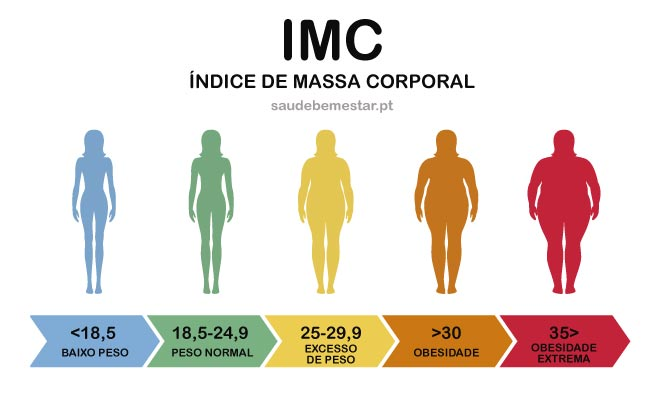

Neste projeto temos uma calculadora IMC simples feita com a utilização do javascript. No projeto usamos alguns recursos, como template strings e manipulação de elementos HTML no DOM. 

<strong>Sobre o IMC:</strong> O índice de Massa Corporal (IMC), ou em inglês <em>Body Mass Index (BMI)</em> é uma das maneiras de saber se o seu peso está adequado à sua altura. A classificação do IMC pode ajudar a identificar problemas de obesidade ou desnutrição, em crianças, adolescentes, adultos e idosos. Para calcular devemos dividir seu peso pela altura elevada ao quadrado.